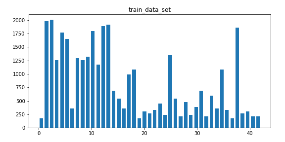
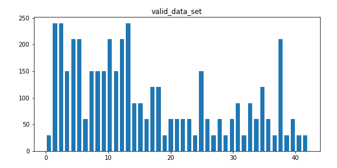
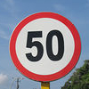
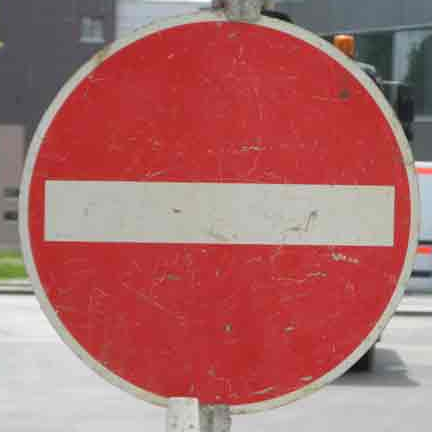
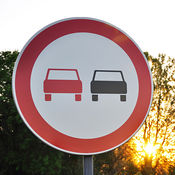
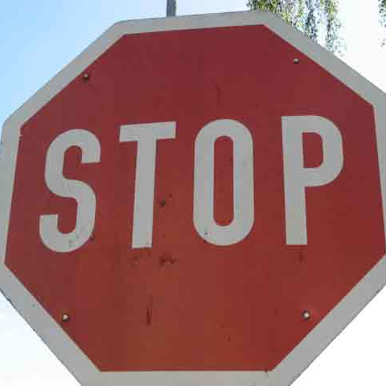
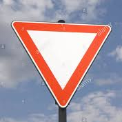

# **Traffic Sign Recognition** 

## Writeup

---

**Build a Traffic Sign Recognition Project**

The goals / steps of this project are the following:
* Load the data set (see below for links to the project data set)
* Explore, summarize and visualize the data set
* Design, train and test a model architecture
* Use the model to make predictions on new images
* Analyze the softmax probabilities of the new images
* Summarize the results with a written report


[//]: # (Image References)

[image1]: ./examples/visualization.jpg "Visualization"
[image2]: ./examples/grayscale.jpg "Grayscaling"
[image3]: ./examples/random_noise.jpg "Random Noise"
[image4]: ./examples/placeholder.png "Traffic Sign 1"
[image5]: ./examples/placeholder.png "Traffic Sign 2"
[image6]: ./examples/placeholder.png "Traffic Sign 3"
[image7]: ./examples/placeholder.png "Traffic Sign 4"
[image8]: ./examples/placeholder.png "Traffic Sign 5"

## Rubric Points
### Here I will consider the [rubric points](https://review.udacity.com/#!/rubrics/481/view) individually and describe how I addressed each point in my implementation.  

---

### Data Set Summary & Exploration

#### 1. Provide a basic summary of the data set. In the code, the analysis should be done using python, numpy and/or pandas methods rather than hardcoding results manually.

I used the pandas library to calculate summary statistics of the traffic
signs data set:

* Number of training examples = 34799
* Number of validation examples = 4410
* Number of testing examples = 12630
* Image data shape = (32, 32)
* Number of classes = 43

#### 2. Include an exploratory visualization of the dataset.

Here is an exploratory visualization of the data set. It is a bar chart showing how the data ...





### Design and Test a Model Architecture

#### 1. Describe how you preprocessed the image data. What techniques were chosen and why did you choose these techniques? Consider including images showing the output of each preprocessing technique. Pre-processing refers to techniques such as converting to grayscale, normalization, etc. (OPTIONAL: As described in the "Stand Out Suggestions" part of the rubric, if you generated additional data for training, describe why you decided to generate additional data, how you generated the data, and provide example images of the additional data. Then describe the characteristics of the augmented training set like number of images in the set, number of images for each class, etc.)

I shuffle the training data first.

Then, I normalized the image data because the normalized data is easy for CPU to train

The difference between the original data set and the augmented data set is the following 

![alt text][image3]

#### 2. Describe what your final model architecture looks like including model type, layers, layer sizes, connectivity, etc.) Consider including a diagram and/or table describing the final model.

My final model consisted of the following layers:

| Layer         		|     Description	        					| 
|:---------------------:|:---------------------------------------------:| 
| Input         		| 32x32x3 Normalized RGB image   	     | 
| Convolution 5x5     	| 1x1 stride, valid padding, outputs 28x28x12 |
| RELU					|												|
| Max pooling	      	| 2x2 stride,  outputs 14x14x12 			  |
| Convolution 5x5	    | 1x1 stride, valid padding, outputs 10x10x16  |
| RELU						|                             |
| Max pooling						| 2x2 stride,  outputs 5x5x16     |
| Flatten						| input 5x5x16, output 400				|
| Fully connected		| input 400, output 120                 |
| RELU						|										   |
| Fully connected		| input 120, output 84        			   	|
| RELU						|										   |
| Fully connected		| input 84, output 43        				 |
| Softmax				|         								   |


#### 3. Describe how you trained your model. The discussion can include the type of optimizer, the batch size, number of epochs and any hyperparameters such as learning rate.

First of all, batch size need to be adjusted, I used the 128 which is 2^7, it's good for ram to store data. then I fixed the epochs to 20 and adjust the learning rate from 0.01 to 0.0001, I was trying to find out the good rate to get reasonable validation accuracy and also don't overfit the train set.

* rate = 0.001
* batch_size = 128
* training_epochs = 20

#### 4. Describe the approach taken for finding a solution and getting the validation set accuracy to be at least 0.93. Include in the discussion the results on the training, validation and test sets and where in the code these were calculated. Your approach may have been an iterative process, in which case, outline the steps you took to get to the final solution and why you chose those steps. Perhaps your solution involved an already well known implementation or architecture. In this case, discuss why you think the architecture is suitable for the current problem.

My final model results were:
* training set accuracy of 0.996
* validation set accuracy of 0.964
* test set accuracy of 0.873

If an iterative approach was chosen:
* What was the first architecture that was tried and why was it chosen?
* What were some problems with the initial architecture?
* How was the architecture adjusted and why was it adjusted? Typical adjustments could include choosing a different model architecture, adding or taking away layers (pooling, dropout, convolution, etc), using an activation function or changing the activation function. One common justification for adjusting an architecture would be due to overfitting or underfitting. A high accuracy on the training set but low accuracy on the validation set indicates over fitting; a low accuracy on both sets indicates under fitting.
* Which parameters were tuned? How were they adjusted and why?
* What are some of the important design choices and why were they chosen? For example, why might a convolution layer work well with this problem? How might a dropout layer help with creating a successful model?

If a well known architecture was chosen:
* What architecture was chosen?

    I pick the LeNet architecture
 
 
* Why did you believe it would be relevant to the traffic sign application?

    Because LeNet architecture is good at picking profile from image and dig into details, that meaks the LeNet a good model to classify different traffic signs


* How does the final model's accuracy on the training, validation and test set provide evidence that the model is working well?
    
    * training set accuracy of 0.996
    * validation set accuracy of 0.964
    * test set accuracy of 0.873
     These results are showing that the model is a solid traffic sign classifier.

### Test a Model on New Images

#### 1. Choose five German traffic signs found on the web and provide them in the report. For each image, discuss what quality or qualities might be difficult to classify.

Here are five German traffic signs that I found on the web:

Since the size of images are different, so I use some codes to convert the size

```
### Convert German traffic image set shape to (32,32,3)
def image_convert(image):
    image.thumbnail((32, 32, 3), Image.ANTIALIAS)  # resizes image in-place
    conv_img = np.asarray(image)
    return conv_img
```











The stop sign should be most difficult because the image is partial traffic sign

#### 2. Discuss the model's predictions on these new traffic signs and compare the results to predicting on the test set. At a minimum, discuss what the predictions were, the accuracy on these new predictions, and compare the accuracy to the accuracy on the test set (OPTIONAL: Discuss the results in more detail as described in the "Stand Out Suggestions" part of the rubric).

Here are the results of the prediction:

| Image			      |     Prediction	        					| 
|:---------------------:|:----------------------------:| 
| 50_speed_limit      | Speed limit (30km/h)   				| 
| no_entry     		  | No entry 									      |
| no_passing			| No passing											|
| stop_sign	      	  | Stop sign					 				|
| yield		         | Yield      |

The model was able to correctly guess 4 of the 5 traffic signs, which gives an accuracy of 80%. This compares favorably to the accuracy on the test set of ...

#### 3. Describe how certain the model is when predicting on each of the five new images by looking at the softmax probabilities for each prediction. Provide the top 5 softmax probabilities for each image along with the sign type of each probability. (OPTIONAL: as described in the "Stand Out Suggestions" part of the rubric, visualizations can also be provided such as bar charts)

The code for making predictions on my final model is located in the 11th cell of the Ipython notebook.

The charts below are showing the probality distrubutions on top 5 softmax probabilities.

Actual Label: 50_speed_limit


| Probability        | Prediction	       |        				
|:---------------------:|:----------------------:| 
| 0.9999994         | Speed limit (30km/h)   		   | 
| 4.1189392e-07       | Speed limit (20km/h)			     |
| 2.8291538e-07			| Speed limit (50km/h)				    |
| 9.659913e-17	      | Speed limit (60km/h)		     |
| 2.0102894e-17			| Turn left ahead       |

Actual Label: no_entry


| Probability        | Prediction	       |        				
|:---------------------:|:----------------------:| 
| 1.0         		| No entry   		   | 
| 5.238854e-12     	  | No passing 			     |
| 2.2350454e-20			| Speed limit (20km/h)			    |
| 2.6176094e-22	      | Yield		     |
| 1.1077811e-24			| No vehicles       |

Actual Label: no_passing


| Probability        | Prediction	       |        				
|:---------------------:|:----------------------:| 
| 1.0        		 | No passing  		   | 
| 3.3032703e-28       | No entry 			     |
| 5.8333505e-38			| End of no passing			    |
| 8.903517e-39	      | No passing for vehicles over 3.5 metric tons		     |
| 7.6772e-41			| Vehicles over 3.5 metric tons prohibited      |

Actual Label: stop_sign


| Probability        | Prediction	       |        				
|:---------------------:|:----------------------:| 
| 0.99999297         | Stop sign   		   | 
|  6.9844946e-06   	   | U-turn 			     |
| 9.699276e-08			| Yield				    |
| 2.0019729e-10	      | Bumpy Road		     |
|  3.921084e-11			| Slippery Road       |

Actual Label: yield


| Probability        | Prediction	       |        				
|:---------------------:|:----------------------:| 
| 1.0        		 | Yield  		   | 
| 0.0     			  | End of no passing by vehicles over 3.5 metric tons			     |
| 0.0					| No passing for vehicles over 3.5 metric tons				    |
| 0.0	      		  | General caution		     |
| 0.0				   | No entry       |


### (Optional) Visualizing the Neural Network (See Step 4 of the Ipython notebook for more details)
#### 1. Discuss the visual output of your trained network's feature maps. What characteristics did the neural network use to make classifications?


